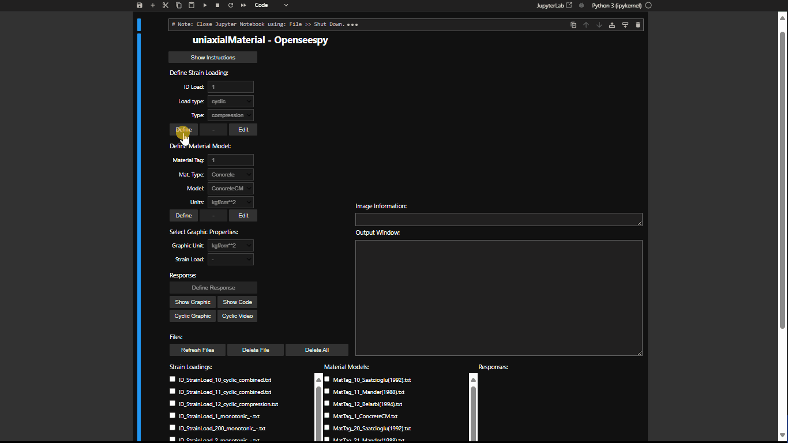
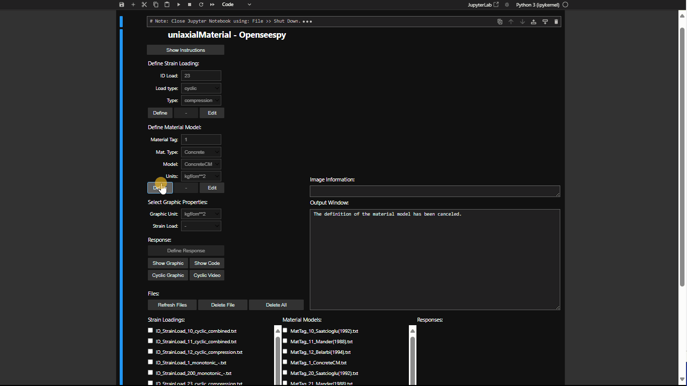

# uniaxialMaterial
La interfaz gráfica de usuario (GUI) permite a los usuarios visualizar cómo cada parámetro afecta la definición de un material, regularizar el hormigón y comparar los modelos de comportamiento de OpenSees con los modelos analíticos. Facilita el proceso de aprendizaje en la definición y manejo de materiales, proporcionando una comprensión holística de su comportamiento en tensión, compresión y ante carga cíclica. El código está inspirado en el script `test.py` desarrollado por A. Schellenberg, Ph.D., [Enlace test.py](https://github.com/fmckenna/OpenSees/blob/master/SRC/interpreter/test.py)

## Load Strain

## Material Model

## Regularization

## Cyclic - Code - Video


# INSTALACIÓN

## PARTE 1: Obtener los archivos del repositorio

### OPCIÓN A (Para principiantes): Descarga directa 🖥️
1. Ve al repositorio en GitHub
2. Haz clic en botón verde "Code"
3. Selecciona "Download ZIP"
4. Descomprime el archivo en tu computadora

### OPCIÓN B (Para usuarios con conocimientos técnicos): Clonar repositorio 👨‍💻
```bash
git clone https://github.com/MarceloX3/uniaxialMaterial
```

## PARTE 2: Configuración del Entorno
5. Abrir Anaconda Prompt
6. Navegar a carpeta del proyecto
```bash
cd ruta/a/tu/proyecto
```
7. Crear entorno virtual conda
```bash
conda create --name env_uniaxialMaterial --file environment_conda.txt
```
8. Activar entorno
```bash
conda activate env_uniaxialMaterial
```
9. Instalar dependencias pip
```bash
pip install -r requirements_pip.txt
```

## PARTE 3: Ejecución

### OPCIÓN A (Para principiantes): Ejecución manual
1. Abre Anaconda Prompt
2. Activa el entorno: `conda activate env_uniaxialMaterial`
3. Inicia Jupyter Notebook: `jupyter notebook`
4. Abre el archivo `.ipynb`
5. Ejecuta

### OPCIÓN B (Para usuarios con conocimientos técnicos): Ejecución desde un acceso directo

Un archivo `.bat` (batch) es un script ejecutable en sistemas Windows que permite automatizar tareas, como activar un entorno virtual y ejecutar un archivo `.ipynb`. Este método facilita iniciar el proyecto directamente desde un acceso directo.

#### Pasos para configurar y usar un archivo `.bat`:

1. **Identificar la ruta del entorno virtual:**
   - Abre la GUI FiberSection acorde a las instrucciones de la Opción A.
   - Crea una nueva celda y ejecuta el siguiente código:
     ```python
     import sys
     print(sys.executable)
     ```
   - Copia el resultado, que es la ruta del entorno donde se ejecuta Jupyter.

2. **Crear el archivo `.bat`:**
   - Abre un editor de texto.
   - Copia y pega el siguiente código, reemplazando `RUTA_DEL_ENTORNO` con la ruta obtenida en el paso anterior:
     ```batch
     @echo off

     REM Configurar la ruta del entorno virtual
     set ANACONDAPATH=RUTA_DEL_ENTORNO

     REM Configurar variables del entorno
     start %ANACONDAPATH%\python.exe %ANACONDAPATH%\cwp.py %ANACONDAPATH% ^

     REM Abrir el archivo .ipynb especificado
     start %ANACONDAPATH%\python.exe %ANACONDAPATH%\Scripts\jupyter-notebook.exe %1

     exit
     ```
   - Guarda el archivo con la extensión `.bat` (por ejemplo, `IniciarNotebook.bat`).

3. **Asociar el archivo `.bat` con archivos `.ipynb`:**
   - Haz clic derecho sobre el archivo `S01_GUI02_uniaxialMaterial.ipynb` y selecciona "Propiedades".
   - En "Abrir con", selecciona el archivo `.bat` creado.
   - Esto permitirá abrir el entorno y ejecutar el archivo automáticamente al hacer doble clic.
   - 
4. **Crear un acceso directo y personalizarlo (opcional):**
   - Crea un acceso directo al archivo `S01_GUI02_uniaxialMaterial.ipynb`.
   - Mueve el acceso directo a un lugar conveniente.
   - Personaliza el icono haciendo clic derecho en el acceso directo, seleccionando "Propiedades" > "Cambiar icono" y eligiendo un archivo `.ico` característico.

Este método proporciona una forma práctica y rápida de iniciar el proyecto sin necesidad de abrir manualmente el entorno o Jupyter Notebook.
